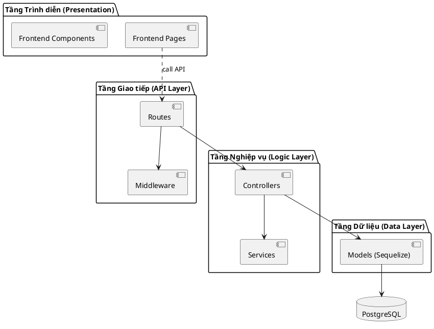

# Thiết kế Kiến trúc Phần mềm - DarkSun

Tài liệu này mô tả chi tiết về kiến trúc phần mềm được lựa chọn cho hệ thống Quản lý Chung cư DarkSun, cách áp dụng vào thực tế mã nguồn và sơ đồ phân rã các gói thành phần.

---

## 1. Lựa chọn Kiến trúc: Kiến trúc Phân tầng kết hợp MVC (Layered MVC Architecture)

Hệ thống DarkSun được xây dựng trên nền tảng **Kiến trúc đa tầng (Multi-tier Architecture)**, cụ thể là mô hình 3 lớp (3-Tier) tích hợp với mô hình **MVC (Model-View-Controller)**.

### Giải thích sơ bộ về kiến trúc:
*   **Model (Lớp Dữ liệu):** Chịu trách nhiệm quản lý dữ liệu, bao gồm việc lưu trữ, truy xuất và định nghĩa các thực thể nghiệp vụ (Entities). Nó không quan tâm đến giao diện người dùng.
*   **View (Lớp Trình diễn):** Hiển thị dữ liệu cho người dùng và gửi các yêu cầu tương tác. Trong web app hiện đại, View được tách rời thành một ứng dụng Client-side độc lập.
*   **Controller (Lớp Điều khiển):** Đóng vai trò trung gian, nhận yêu cầu từ View, gọi các Model tương ứng để xử lý dữ liệu và trả kết quả về cho View.

---

## 2. Mô tả Kiến trúc Cụ thể cho Ứng dụng DarkSun

Dựa trên lý thuyết MVC, chúng tôi đã áp dụng và có những cải tiến để phù hợp với môi trường Node.js/React, đảm bảo tính mở rộng (scalability) và dễ bảo trì.

### A. Thành phần Model (M) - Sự kết hợp giữa Schema và Logic truy cập
Trong DarkSun, thành phần M không chỉ là một class đơn lẻ mà là một hệ thống các thành phần:
*   **Sequelize Model Classes:** Ví dụ `Resident.js`, `Household.js`. Đây là các class kế thừa từ `Sequelize.Model` định nghĩa thuộc tính và kiểu dữ liệu của thực thể.
*   **Static Association Methods:** Mỗi Model có một hàm `static associate(models)`. Đây được coi là phần định nghĩa "Interface" cho mối quan hệ dữ liệu, giúp các Model khác có thể liên kết mà không cần biết chi tiết bên trong.
*   **Model Index (models/index.js):** Đóng vai trò là một **Factory** khởi tạo tất cả các Model và thiết lập quan hệ, cung cấp một đối tượng `db` duy nhất để truy cập toàn bộ tầng dữ liệu.

### B. Thành phần View (V) - Kiến trúc Client-side Rendering
Chúng tôi sử dụng **React.js** để đảm nhiệm phần View:
*   **Pages Layer:** (Vd: `DashboardPage.jsx`) Đóng vai trò là các View chính của từng tính năng.
*   **Components Layer:** Các đơn vị giao diện nhỏ hơn (Atom/Molecule), giúp tái sử dụng mã nguồn.
*   **Service Layer (Frontend):** Các file trong `frontend/src/services/` đóng vai trò là "Data Provider" cho View, trừu tượng hóa các cuộc gọi API HTTP.

### C. Thành phần Controller (C) - Cải tiến với Middleware và Service
Thay vì chỉ có Controller thuần túy, ứng dụng có sự bổ sung các thành phần "C" chi tiết hơn:
*   **Route Dispatcher:** (Vd: `residentRoutes.js`) Phân loại các HTTP verb (GET, POST, PUT, DELETE) và điều hướng đến logic xử lý.
*   **Middlewares (Thành phần bổ sung):** Được chèn vào trước Controller để xử lý các vấn đề xuyên cắt (Cross-cutting Concerns) như:
    *   `authMiddleware`: Xác thực danh tính qua JWT.
    *   `roleMiddleware`: Kiểm tra quyền hạn trước khi cho phép vào Controller.
*   **Thin Controllers:** Các tệp trong `controllers/` tập trung vào việc điều phối dòng chảy (Dòng điều khiển). Các logic tính toán nặng hoặc xuất tệp được đẩy sâu xuống các module **Utility/Service** để giữ cho Controller luôn gọn gàng.

### D. Bảng ánh xạ Lý thuyết vào Thực tế

| Thành phần lý thuyết | Thành phần cụ thể trong DarkSun | Vị trí thư mục |
| :--- | :--- | :--- |
| **Model** | Sequelize Models + Association Logic | `/backend/models/` |
| **View** | React Pages + Components + Layouts | `/frontend/src/` |
| **Controller** | Controllers + Routes Dispatcher | `/backend/controllers/`, `/backend/routes/` |
| **Logic bổ trợ** | Middlewares + Password Utils + PDF/Excel Services | `/backend/middleware/`, `/backend/utils/` |

---

## 3. Điểm cải tiến và Bổ sung
So với mô hình MVC truyền thống, DarkSun có các điểm cải tiến:
1.  **Dùng ORM (Sequelize):** Giúp loại bỏ sự phụ thuộc vào SQL thuần, làm cho Model có tính trừu tượng hóa cao hơn.
2.  **API-Driven Architecture:** MVC thường dùng cho ứng dụng Server-side Rendering (V và C dính liền). DarkSun tách biệt hoàn toàn V (Frontend) và C+M (Backend), giao tiếp qua JSON, giúp hệ thống có thể mở rộng sang ứng dụng di động sau này dễ dàng.
3.  **Hệ thống Middleware:** Tăng tính tái sử dụng cho các logic kiểm tra bảo mật, không cần viết lại trong từng Controller.

---

## 3. Biểu đồ Gói UML (UML Package Diagram)

Biểu đồ dưới đây mô tả sự phụ thuộc giữa các gói trong hệ thống, được phân chia theo các tầng rõ ràng.

### Biểu đồ: 
*(Xem chi tiết tại tệp: `package_diagram.puml`)*

### Giải thích các Gói (Package):

1.  **Frontend Pages/Components:** Chứa giao diện người dùng và logic hiển thị. Gói này phụ thuộc vào Backend thông qua giao thức HTTP (không phụ thuộc mã nguồn trực tiếp).
2.  **Routes:** Định nghĩa các điểm cuối (endpoints) của API. Nó là gói đầu tiên tiếp nhận request và điều phối đến Controller.
3.  **Middleware:** Chứa các bộ lọc tiền xử lý (như xác thực Auth, ghi log). Nó hỗ trợ gói Routes để bảo vệ các tài nguyên.
4.  **Controllers:** Chứa logic nghiệp vụ chính. Nó điều phối dòng chảy dữ liệu giữa người dùng và database.
5.  **Services:** (Thành phần bổ sung) Chứa các logic tính toán phức tạp hoặc tích hợp bên thứ ba (ví dụ: xuất Excel/PDF), giúp Controller gọn gàng hơn.
6.  **Models (Sequelize):** Gói thấp nhất trong mã nguồn ứng dụng, chịu trách nhiệm định nghĩa schema và tương tác trực tiếp với Database. Nó hoàn toàn độc lập với các logic giao diện hay điều hướng.

### Quy tắc thiết kế áp dụng:
*   **Nguyên tắc một chiều:** Phụ thuộc chỉ đi từ trên xuống dưới (Vd: Controller gọi Model, nhưng Model không bao giờ biết về Controller).
*   **Tính độc lập:** Các gói cùng tầng (như `Middleware` và `Routes`) hỗ trợ nhau nhưng có thể thay thế hoặc mở rộng mà không làm hỏng cấu trúc các tầng khác.
*   **Tách biệt (Separation of Concerns):** Mỗi gói chỉ làm đúng một nhiệm vụ, giúp việc bảo trì và nâng cấp trở nên dễ dàng.
