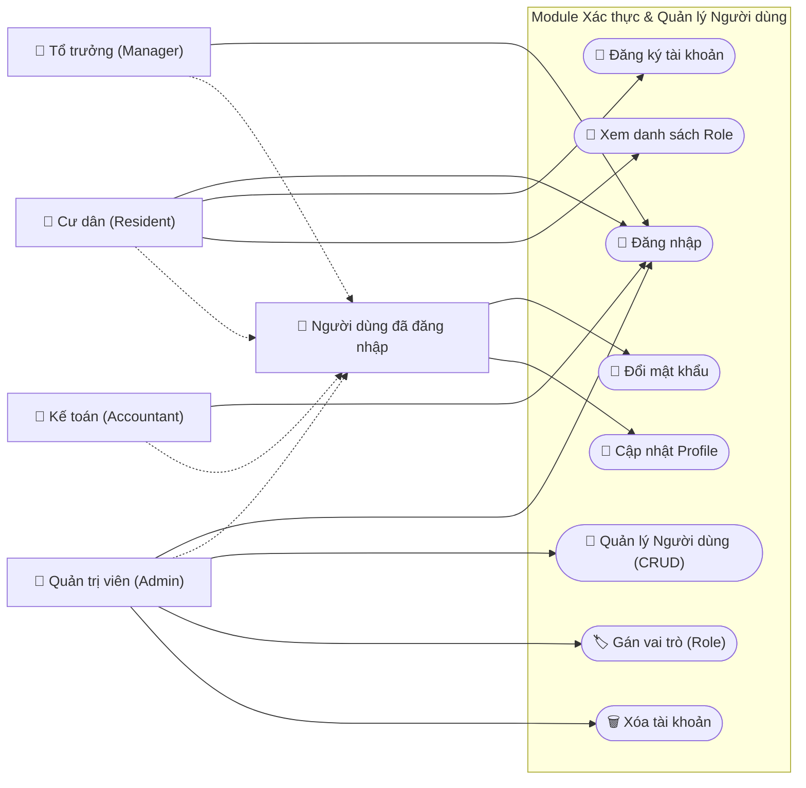

# Auth & User Management Use Cases

```mermaid
graph LR
    %% Actors
    Resident["👤 Cư dân (Resident)"]
    Manager["👤 Tổ trưởng (Manager)"]
    Accountant["👤 Kế toán (Accountant)"]
    Admin["👤 Quản trị viên (Admin)"]
    
    %% Abstract Actor
    AuthenticatedUser["👤 Người dùng đã đăng nhập"]

    %% System
    subgraph Module ["Module Xác thực & Quản lý Người dùng"]
        direction TB
        UC_Login(["🔐 Đăng nhập"])
        UC_Register(["📝 Đăng ký tài khoản"])
        UC_ChangePass(["🔑 Đổi mật khẩu"])
        UC_UpdateProfile(["📝 Cập nhật Profile"])
        UC_ViewRoles(["👀 Xem danh sách Role"])
        UC_CRUD_User(["👥 Quản lý Người dùng (CRUD)"])
        UC_AssignRole(["🏷️ Gán vai trò (Role)"])
        UC_DeleteUser(["🗑️ Xóa tài khoản"])
    end

    %% Relationships - Public
    Resident --> UC_Login
    Resident --> UC_Register
    Resident --> UC_ViewRoles
    
    Manager --> UC_Login
    Accountant --> UC_Login
    Admin --> UC_Login

    %% Relationships - Authenticated Shared
    AuthenticatedUser --> UC_ChangePass
    AuthenticatedUser --> UC_UpdateProfile

    %% Inheritance (All roles are Authenticated Users)
    Resident -.-> AuthenticatedUser
    Manager -.-> AuthenticatedUser
    Accountant -.-> AuthenticatedUser
    Admin -.-> AuthenticatedUser

    %% Relationships - Admin Specific
    Admin --> UC_CRUD_User
    Admin --> UC_AssignRole
    Admin --> UC_DeleteUser
```
