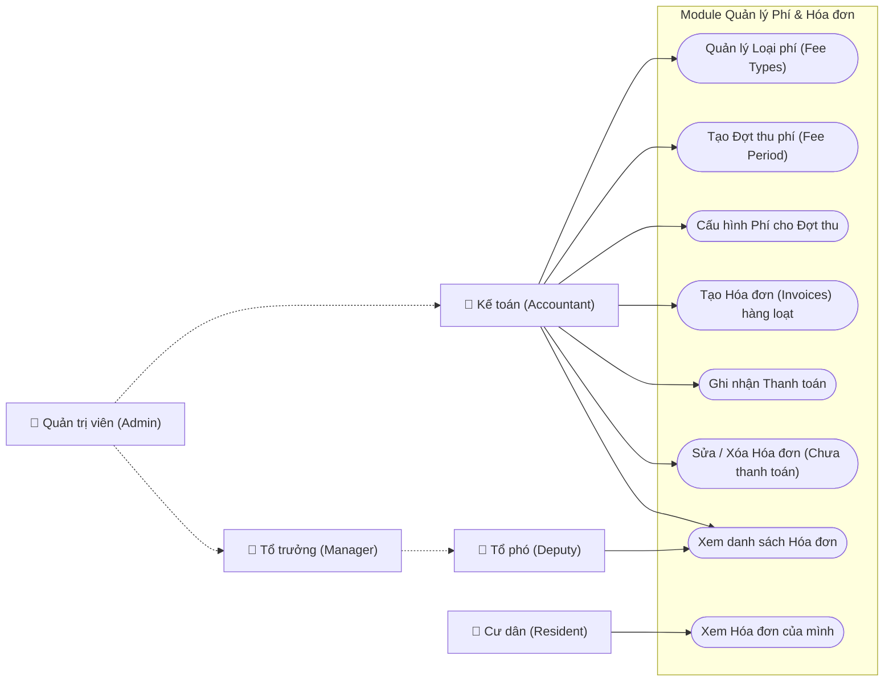

# Fees & Billing Use Cases

```mermaid
graph LR
    %% Actors
    Accountant["👤 Kế toán (Accountant)"]
    Admin["👤 Quản trị viên (Admin)"]
    Manager["👤 Tổ trưởng (Manager)"]
    Deputy["👤 Tổ phó (Deputy)"]
    Resident["👤 Cư dân (Resident)"]

    %% System
    subgraph Module ["Module Quản lý Phí & Hóa đơn"]
        direction TB
        UC_ManageFeeTypes(["Quản lý Loại phí (Fee Types)"])
        UC_CreatePeriod(["Tạo Đợt thu phí (Fee Period)"])
        UC_ConfigFee(["Cấu hình Phí cho Đợt thu"])
        
        UC_GenInvoice(["Tạo Hóa đơn (Invoices) hàng loạt"])
        UC_RecordPayment(["Ghi nhận Thanh toán"])
        UC_EditInvoice(["Sửa / Xóa Hóa đơn (Chưa thanh toán)"])
        
        UC_ViewAllInvoices(["Xem danh sách Hóa đơn"])
        UC_ViewMyInvoice(["Xem Hóa đơn của mình"])
    end

    %% Inheritance
    Admin -.-> Accountant
    Admin -.-> Manager
    Manager -.-> Deputy

    %% Relationships - Manager/Deputy (View Only)
    Deputy --> UC_ViewAllInvoices

    %% Relationships
    Accountant --> UC_ManageFeeTypes
    Accountant --> UC_CreatePeriod
    Accountant --> UC_ConfigFee
    Accountant --> UC_GenInvoice
    Accountant --> UC_RecordPayment
    Accountant --> UC_EditInvoice
    Accountant --> UC_ViewAllInvoices

    Resident --> UC_ViewMyInvoice
```
