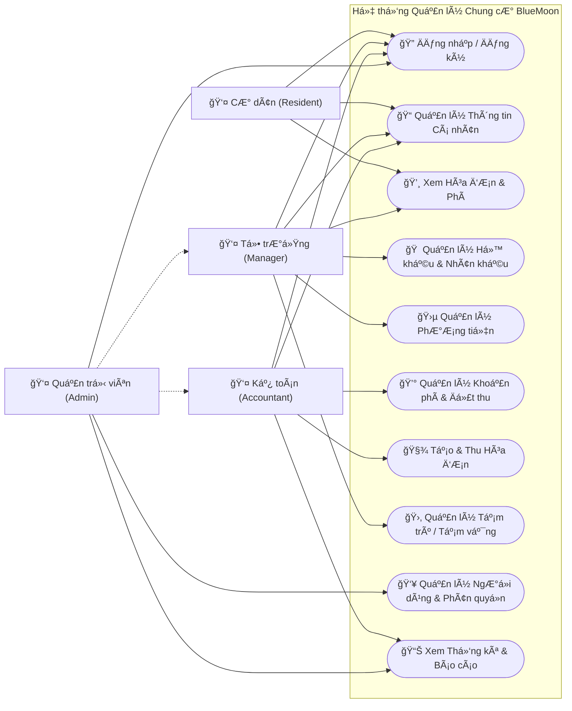

# Overview Use Case Diagram

```mermaid
graph LR
    %% Actors
    Resident["👤 Cư dân (Resident)"]
    Manager["👤 Tổ trưởng (Manager)"]
    Accountant["👤 Kế toán (Accountant)"]
    Admin["👤 Quản trị viên (Admin)"]

    %% System Boundary
    subgraph System ["Hệ thống Quản lý Chung cư BlueMoon"]
        direction TB
        UC_Auth(["🔠Äăng nhập / Äăng ký"])
        UC_Profile(["📠Quản lý Thông tin Cá nhân"])
        UC_ViewBills(["💸 Xem Hóa đơn & Phí"])
        UC_ManageHouse(["🠠Quản lý Hộ khẩu & Nhân khẩu"])
        UC_ManageVehicle(["🛵 Quản lý Phương tiện"])
        UC_ManageFee(["💰 Quản lý Khoản phí & Äợt thu"])
        UC_ManageInvoice(["🧾 Tạo & Thu Hóa đơn"])
        UC_ManageTemp(["🛂 Quản lý Tạm trú / Tạm vắng"])
        UC_ManageUser(["👥 Quản lý NgÆ°á»i dùng & Phân quyá»n"])
        UC_Stats(["📊 Xem Thống kê & Báo cáo"])
    end

    %% Relationships
    Resident --> UC_Auth
    Resident --> UC_Profile
    Resident --> UC_ViewBills

    Manager --> UC_Auth
    Manager --> UC_Profile
    Manager --> UC_ManageHouse
    Manager --> UC_ManageVehicle
    Manager --> UC_ManageTemp
    Manager --> UC_ViewBills

    Accountant --> UC_Auth
    Accountant --> UC_Profile
    Accountant --> UC_ManageFee
    Accountant --> UC_ManageInvoice
    Accountant --> UC_Stats

    Admin --> UC_Auth
    Admin --> UC_ManageUser
    Admin --> UC_Stats
    
    %% Inheritance (Simulated)
    Admin -.-> Manager
    Admin -.-> Accountant
```
