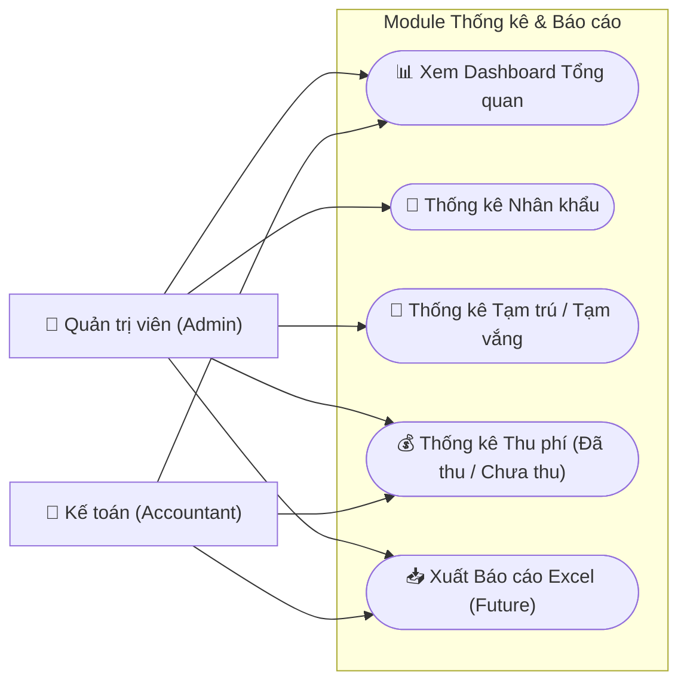

# Statistics & Reporting Use Cases

```mermaid
graph LR
    %% Actors
    Accountant["👤 Kế toán (Accountant)"]
    Admin["👤 Quản trị viên (Admin)"]

    %% System
    subgraph Module ["Module Thống kê & Báo cáo"]
        direction TB
        UC_Dashboard(["📊 Xem Dashboard Tổng quan"])
        UC_StatResident(["👥 Thống kê Nhân khẩu"])
        UC_StatTemp(["🛂 Thống kê Tạm trú / Tạm vắng"])
        UC_StatFees(["💰 Thống kê Thu phí (Đã thu / Chưa thu)"])
        UC_Export(["📥 Xuất Báo cáo Excel (Future)"])
    end

    %% Relationships
    Admin --> UC_Dashboard
    Admin --> UC_StatResident
    Admin --> UC_StatTemp
    Admin --> UC_StatFees
    Admin --> UC_Export

    Accountant --> UC_Dashboard
    Accountant --> UC_StatFees
    Accountant --> UC_Export
```
