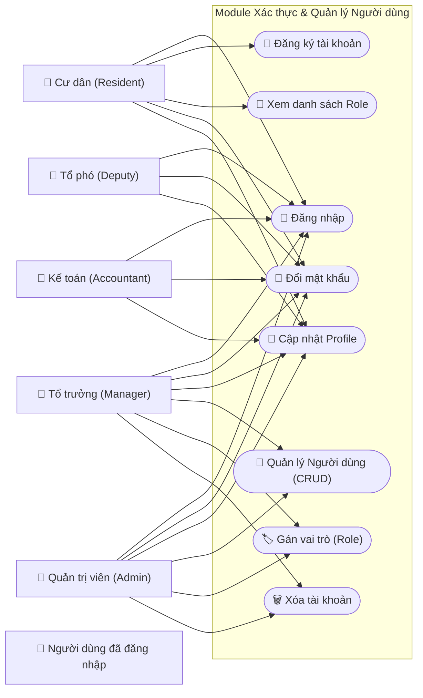

# Auth & User Management Use Cases

## Chi tiết Use Case (Phân rã)

### 1. Quản lý Tài khoản (User Account Management)
* **Tạo tài khoản mới**: 
    - Quản lý có thể tạo tài khoản cho Cư dân hoặc Tổ phó.
    - **Ràng buộc**: Manager KHÔNG THỂ tạo hoặc tác động lên tài khoản Admin.
* **Xóa tài khoản**: Thực hiện "Xóa mềm" (status = 'deleted') để đảm bảo toàn vẹn dữ liệu lịch sử.

### 2. Phân quyền (Role Assignment)
* Gán 1 hoặc nhiều vai trò cho người dùng.
* **Ràng buộc**: Chỉ Admin mới có quyền gán vai trò "Admin". Manager chỉ có thể gán Resident, Deputy, Accountant.

