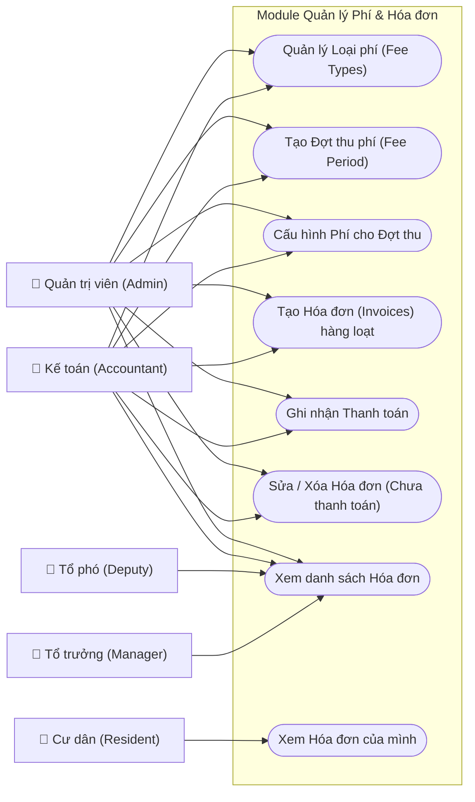

# Fees & Billing Use Cases

## Chi tiết Use Case (Phân rã)

### 1. Quản lý Đợt thu (Fee Period Management)
* **Khởi tạo**: Chọn loại đợt thu (**Bắt buộc** hoặc **Đóng góp**).
* **Cấu hình Phí**: 
    - Với đợt **Bắt buộc**: Chọn các loại phí như Vệ sinh, Gửi xe... Thiết lập đơn giá hoặc dùng giá mặc định.
    - Với đợt **Đóng góp**: Chỉ cho phép chọn các loại quỹ từ thiện, khuyến học.
* **Chốt đợt thu**: Chuyển trạng thái từ `open` sang `closed` để ngăn chặn chỉnh sửa hóa đơn.

### 2. Quản lý Hóa đơn (Invoice Management)
* **Tạo hàng loạt**: Hệ thống duyệt danh sách hộ khẩu và phương tiện để tự động tính toán số tiền dựa trên diện tích và số xe.
* **Thanh toán**: Cập nhật trạng thái `paid` sau khi xác nhận nhận tiền thực tế.
* **Xuất hóa đơn**: Render file PDF/Hình ảnh cho cư dân tải về.

