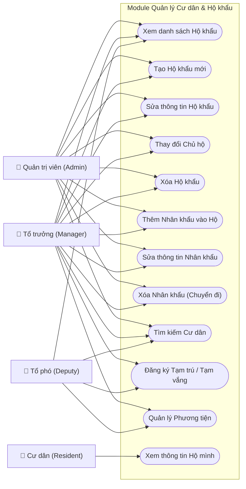

# Resident & Household Management Use Cases

## Chi tiết Use Case (Phân rã)

### 1. Quản lý Hộ khẩu (Household Management)
* **Xem danh sách**: Tất cả cán bộ có quyền truy cập module.
* **Tạo mới**: Yêu cầu mã hộ khẩu duy nhất, địa chỉ, và diện tích. 
* **Thay đổi Chủ hộ**: Hệ thống tự động cập nhật quan hệ "Chủ hộ" cho nhân khẩu được chọn và hủy trạng thái chủ hộ cũ.
* **Xóa Hộ khẩu**: Chỉ được thực hiện khi hộ không còn nhân khẩu đang cư trú.

### 2. Quản lý Nhân khẩu (Resident Management)
* **Thêm mới**: Có thể thêm từ "Khai báo nhân khẩu" (Manager/Admin) hoặc từ "Đăng ký cư dân" (Public).
* **Tạm trú/Tạm vắng**: 
    - Đăng ký ngày bắt đầu, ngày kết thúc và lý do.
    - Hệ thống đánh dấu trạng thái đặc biệt cho nhân khẩu.
* **Xóa Nhân khẩu**: Thực hiện xóa mềm (status = 'deleted') để lưu trữ lịch sử cư trú.

### 3. Quản lý Phương tiện (Vehicle Management)
* Liên kết trực tiếp với mã hộ khẩu.
* Phân loại: **Ô tô** và **Xe máy** để tính phí gửi xe tương ứng.

