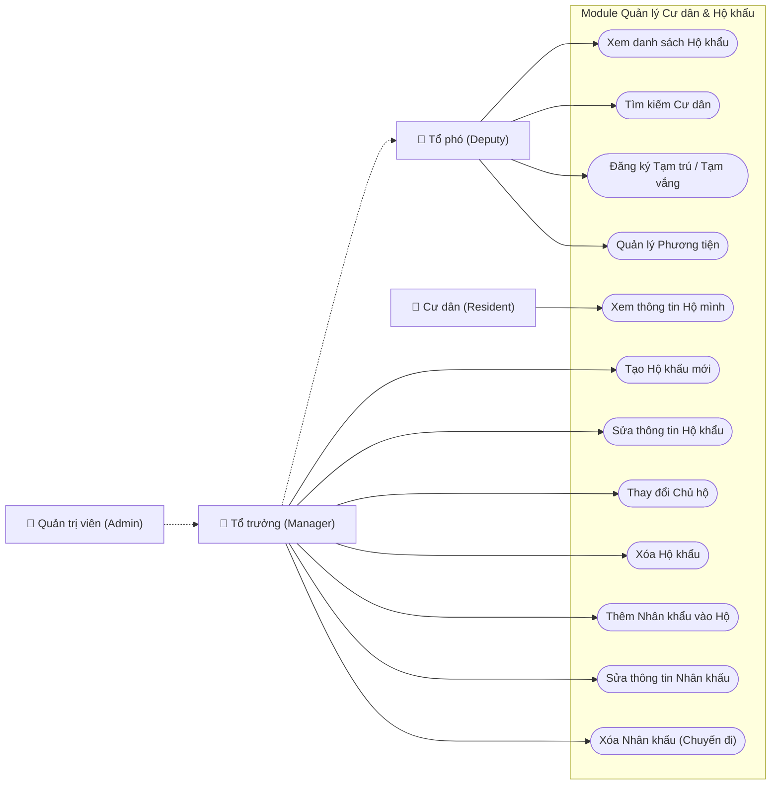

# Resident & Household Management Use Cases

```mermaid
graph LR
    %% Actors
    Manager["👤 Tổ trưởng (Manager)"]
    Deputy["👤 Tổ phó (Deputy)"]
    Admin["👤 Quản trị viên (Admin)"]
    Resident["👤 Cư dân (Resident)"]

    %% System
    subgraph Module ["Module Quản lý Cư dân & Hộ khẩu"]
        direction TB
        UC_ViewHouse(["Xem danh sách Hộ khẩu"])
        UC_CreateHouse(["Tạo Hộ khẩu mới"])
        UC_EditHouse(["Sửa thông tin Hộ khẩu"])
        UC_ChangeOwner(["Thay đổi Chủ hộ"])
        UC_DeleteHouse(["Xóa Hộ khẩu"])
        
        UC_AddResident(["Thêm Nhân khẩu vào Hộ"])
        UC_EditResident(["Sửa thông tin Nhân khẩu"])
        UC_DeleteResident(["Xóa Nhân khẩu (Chuyển đi)"])
        UC_SearchResident(["Tìm kiếm Cư dân"])
        
        UC_TempStay(["Đăng ký Tạm trú / Tạm vắng"])
        UC_ManageVehicle(["Quản lý Phương tiện"])
        
        UC_ViewMyHouse(["Xem thông tin Hộ mình"])
    end

    %% Inheritance
    Admin -.-> Manager
    Manager -.-> Deputy
    
    %% Relationships - Deputy (View Only)
    Deputy --> UC_ViewHouse
    Deputy --> UC_SearchResident
    Deputy --> UC_TempStay
    Deputy --> UC_ManageVehicle

    %% Relationships - Manager (Full Control)
    Manager --> UC_CreateHouse
    Manager --> UC_EditHouse
    Manager --> UC_ChangeOwner
    Manager --> UC_DeleteHouse
    
    Manager --> UC_AddResident
    Manager --> UC_EditResident
    Manager --> UC_DeleteResident
    
    %% Relationships - Resident
    Resident --> UC_ViewMyHouse
```
