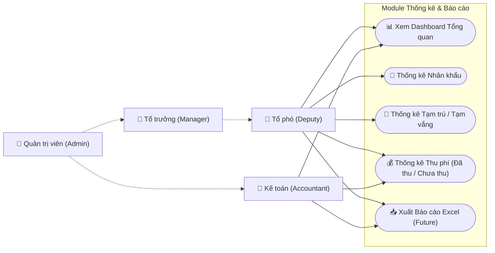

# Statistics & Reporting Use Cases

```mermaid
graph LR
    %% Actors
    Manager["👤 Tổ trưởng (Manager)"]
    Deputy["👤 Tổ phó (Deputy)"]
    Accountant["👤 Kế toán (Accountant)"]
    Admin["👤 Quản trị viên (Admin)"]

    %% System
    subgraph Module ["Module Thống kê & Báo cáo"]
        direction TB
        UC_Dashboard(["📊 Xem Dashboard Tổng quan"])
        UC_StatResident(["👥 Thống kê Nhân khẩu"])
        UC_StatTemp(["🛂 Thống kê Tạm trú / Tạm vắng"])
        UC_StatFees(["💰 Thống kê Thu phí (Đã thu / Chưa thu)"])
        UC_Export(["📥 Xuất Báo cáo Excel (Future)"])
    end
    
    %% Inheritance
    Admin -.-> Manager
    Manager -.-> Deputy
    Admin -.-> Accountant

    %% Relationships - Deputy (Broad Access)
    Deputy --> UC_Dashboard
    Deputy --> UC_StatResident
    Deputy --> UC_StatTemp
    Deputy --> UC_StatFees
    Deputy --> UC_Export

    %% Relationships - Accountant (Financial Focus)
    Accountant --> UC_Dashboard
    Accountant --> UC_StatFees
    Accountant --> UC_Export
```
