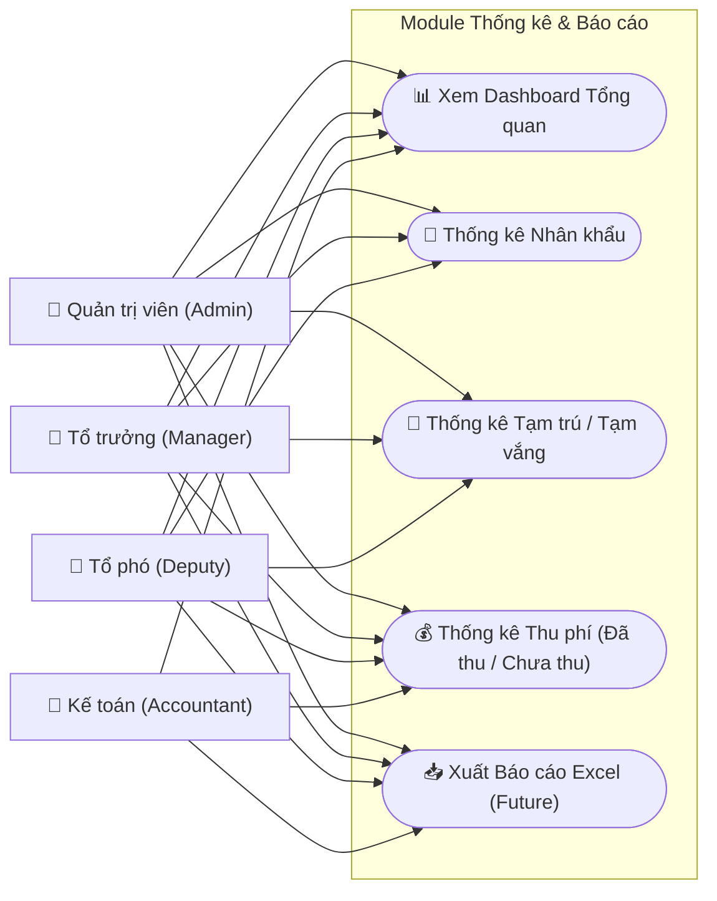

# Statistics & Reporting Use Cases

## Chi tiết Use Case (Phân rã)

### 1. Dashboard Analytics
* **Biểu đồ**: Hiển thị tỷ lệ thanh toán, phân bố nhân khẩu theo độ tuổi/giới tính.
* **Tổng quan**: Số lượng hộ khẩu, tổng số cư dân, tổng tiền đã thu trong tháng.

### 2. Thống kê & Báo cáo
* **Thống kê nhân khẩu**: Lọc theo tạm trú, tạm vắng, độ tuổi lao động.
* **Thống kê Tài chính**: Danh sách các hộ chưa đóng phí.
* **Xuất dữ liệu**: Hỗ trợ xuất file Excel phục vụ việc nộp báo cáo cho cấp trên hoặc lưu trữ bản cứng.

